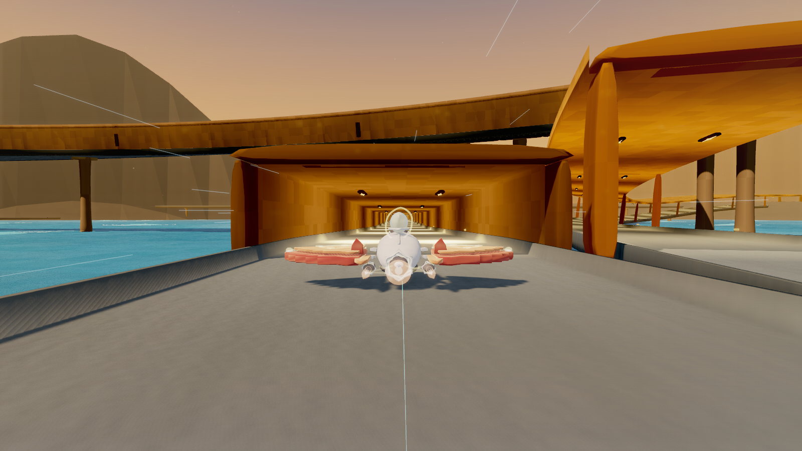
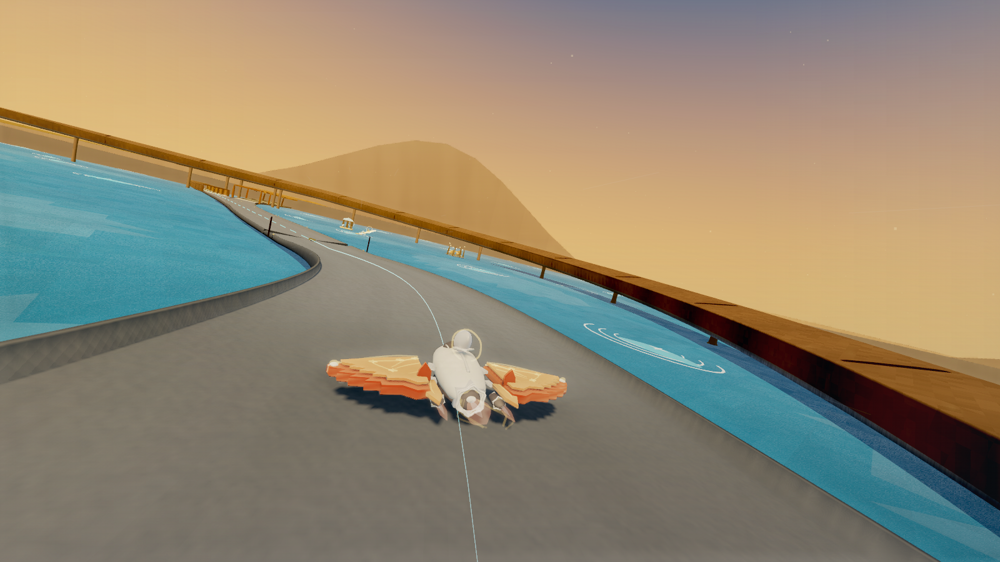
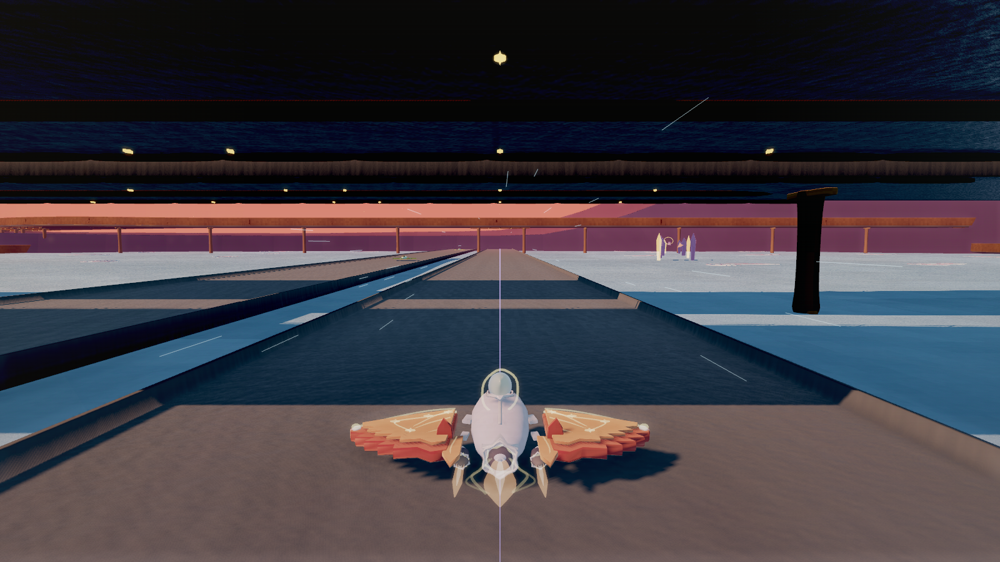

<a name="top"></a>

<p align="center">
  
</p>

<p align="center">
  <strong>A browser journey through clouds, candlelight and open skies.</strong><br>
  Take the controls, follow the route, or settle into an autopilot cruise.
</p>

<p align="center">
  <a href="#quick-start">Start flying</a> ·
  <a href="#controls">Controls</a> ·
  <a href="#gallery">Gallery</a> ·
  <a href="#development">Development</a> ·
  <a href="README.md">简体中文</a>
</p>

<p align="center">
  <code>Three.js / WebGL</code> &nbsp;
  <code>No build step</code> &nbsp;
  <code>Keyboard + touch</code> &nbsp;
  <code>中文 / English</code>
</p>



<p align="center"><sub>In-game capture · Interchange and ramp entrance · High quality · HUD hidden</sub></p>

**Neon Autopilot** is a 3D flight and driving game that runs in your browser. Guide a caped craft through elevated roads, interchanges and tunnels, collect candlelight, and respond to changing weather. Turn on autopilot and the cinematic camera to take in the journey.

## One journey, several ways to fly

<table>
  <tr>
    <td width="50%"><strong>Manual flight &amp; autopilot</strong><br>Steer, accelerate, brake and jump yourself, or press P to watch autopilot plan its route and respond to obstacles.</td>
    <td width="50%"><strong>Three gears, connected feedback</strong><br>Switch between manual and automatic transmission. RPM, thrust, shifting and ground conditions shape the drive.</td>
  </tr>
  <tr>
    <td><strong>Six realms &amp; changing weather</strong><br>Travel from dawn clouds to twilight and starry skies, through rain, snow, storms and sheltered tunnels.</td>
    <td><strong>Driving views &amp; cinematic shots</strong><br>Four driving views and an independent Film mode let you follow the craft closely or take in the horizon.</td>
  </tr>
  <tr>
    <td><strong>Candlelight &amp; growth</strong><br>Collect light along the route to gradually change your craft's colors, handling and propulsion capability.</td>
    <td><strong>A soundtrack for each realm</strong><br>Twelve bundled music tracks accompany weather, propulsion and surface-contact sounds throughout the journey.</td>
  </tr>
</table>

<a name="quick-start"></a>

## Start flying

**[Download the complete project ZIP](https://github.com/shi-zhe-lei/Neon_Autopilot_HighSpeed_DroneHeat/archive/refs/heads/main.zip)** and extract it, or clone with Git:

```sh
git clone https://github.com/shi-zhe-lei/Neon_Autopilot_HighSpeed_DroneHeat.git
cd Neon_Autopilot_HighSpeed_DroneHeat
```

Keep the project directory intact, then choose your platform:

| Device | Start here |
| :--- | :--- |
| **Windows** | Double-click `Start-Neon-Windows.cmd`; your browser opens automatically. Uses built-in PowerShell 5.1, with no Node.js or Python needed. |
| **macOS** | Install Node.js 20+, connect to a trusted local network, then double-click `Start-Neon-LAN.command`. Open the address it prints. |
| **Phone / iPad** | Open the macOS launcher's address on the same local network in a WebGL-capable browser. Use the on-screen touch controls. |

For your first flight, choose **Medium** quality, select **Ignite and launch**, then hold **W** to accelerate or press **P** for autopilot. The launch and pause screens offer language and quality controls, plus the flight guide.

<details>
<summary><strong>Background service, stopping the game, and static hosting</strong></summary>

- The macOS launcher creates a service for the current user that starts at login. Double-click `Stop-Neon-LAN.command` to disable it. Project paths, Node.js paths, network addresses and available ports are discovered on that computer.
- The Windows launcher serves only the current computer. Close its window to stop the service.
- You can also serve the complete project with a static HTTP server and open `Neon_Autopilot_HighSpeed_DroneHeat.html`. There is no build step; preserve the relative paths of `assets/`, `errors/`, `src/`, `styles/` and `vendor/`.
- See the [launcher and server documentation](server/README.md) for troubleshooting and network configuration.

</details>

<a name="controls"></a>

## Controls

| Key | Action |
| :--- | :--- |
| <kbd>A</kbd> / <kbd>D</kbd> or <kbd>←</kbd> / <kbd>→</kbd> | Steer left / right |
| <kbd>W</kbd> / <kbd>↑</kbd> | Throttle |
| <kbd>S</kbd> / <kbd>↓</kbd> | Brake |
| <kbd>Space</kbd> | Jump |
| <kbd>P</kbd> | Toggle autopilot |
| <kbd>M</kbd> | Hold full throttle when autopilot is off |
| <kbd>T</kbd> | Switch manual / automatic transmission |
| <kbd>Q</kbd> / <kbd>E</kbd> | Downshift / upshift in manual mode |
| <kbd>C</kbd> / <kbd>F</kbd> | Cycle driving view / toggle Film mode |
| <kbd>O</kbd> / <kbd>Esc</kbd> | Pause / resume |
| <kbd>V</kbd> | Toggle sound |

Hold the left mouse button and drag to look around; release it to return smoothly. Phones and tablets provide on-screen driving and display controls.

> **First-flight tip:** A high gear at low speed can lug or stall. Follow the instrument's downshift guidance, or press **T** for automatic transmission. **F** changes the cinematic camera; **P** still controls autopilot.

<a name="gallery"></a>

## A glimpse of the journey

| Entering the ramp | Flying beneath the bridge |
| :---: | :---: |
|  |  |

<sub>Captured during actual flights through the interchange at High quality, with the HUD hidden. See the [capture notes](docs/showcase/README.md) for scene parameters and route positions.</sub>

<a name="development"></a>

## Development & documentation

Built with **HTML / CSS / JavaScript, Three.js r160 and Web Audio**. Runtime assets are bundled in the repository. The production entry needs no CDN and no build step.

With Node.js 20+, run the unified checks from the project root:

```sh
node tools/verify-node.mjs
```

This checks JavaScript syntax, entry and resource consistency, and runs the Node tests. Browser visual checks are documented separately in the [test guide](tests/README.md).

| What you want to explore | Start here |
| :--- | :--- |
| Modules and runtime flow | [Source overview](src/README.md) |
| Windows launch and macOS LAN service | [Server guide](server/README.md) |
| Verification, manifests and maintenance | [Tools](tools/README.md) |
| Design notes, audits and visual evidence | [Documentation index](docs/README.md) |
| Original complete README and implementation notes | [Preserved README](README.legacy.md) |

## Credits & asset sources

Thanks to Three.js and the music and sound creators. Third-party authors, sources and licenses are recorded in the [Three.js notes](vendor/README.md) and [audio credits](assets/audio/README%281%29.md).

---

<p align="center">
  <a href="#top">Back to top ↑</a> &nbsp; · &nbsp; <a href="README.md">简体中文</a>
</p>
