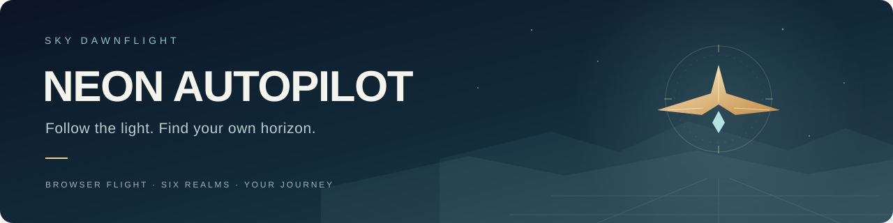
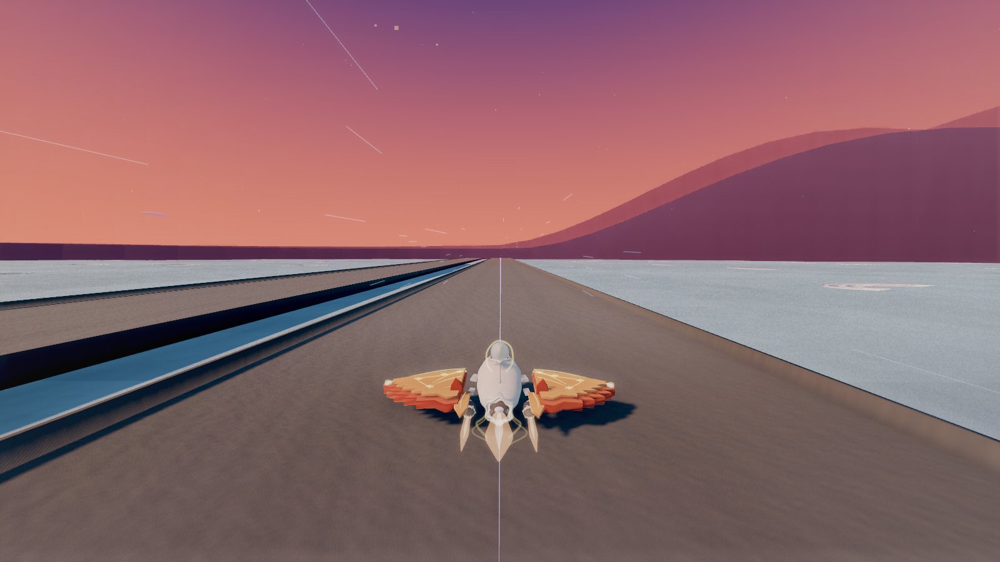
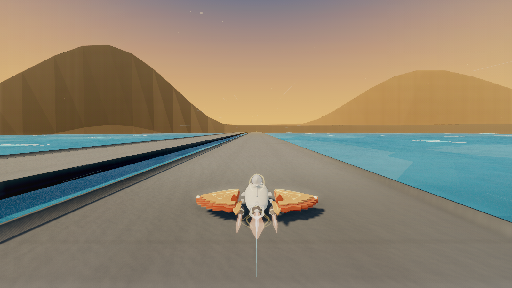
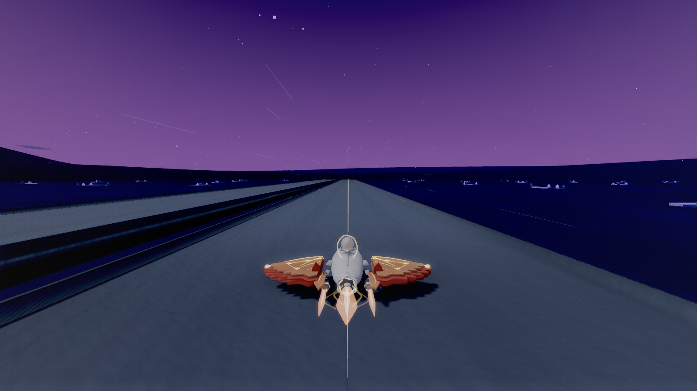

<a name="top"></a>

<p align="center">
  
</p>

<p align="center">
  <strong>霓虹自动领航 · 天际晨航</strong><br>
  驶过云海与暮色，追随烛光，找到属于你的航线。
</p>

<p align="center">
  <a href="#quick-start">开始飞行</a> ·
  <a href="#controls">操作指南</a> ·
  <a href="#gallery">场景一瞥</a> ·
  <a href="#development">开发文档</a> ·
  <a href="README.en.md">English</a>
</p>

<p align="center">
  <code>Three.js / WebGL</code> &nbsp;
  <code>纯前端 · 无需构建</code> &nbsp;
  <code>键盘 + 触控</code> &nbsp;
  <code>中文 / English</code>
</p>



<p align="center"><sub>实机画面 · 高画质 · 为展示场景隐藏了 HUD</sub></p>

**Neon Autopilot** 是一款在浏览器里运行的 3D 飞行驾驶游戏。驾驶披风飞船穿过高架、互通与隧道，收集烛光、应对天气，也可以开启自动领航，跟随电影镜头欣赏沿途风景。

## 一段航程，几种玩法

<table>
  <tr>
    <td width="50%"><strong>手动驾驶与自动领航</strong><br>亲自控制方向、油门、制动与跳跃；按 P 开启领航，观察它规划路线、处理障碍。</td>
    <td width="50%"><strong>三挡推进系统</strong><br>在手动与自动变速箱之间切换，感受换挡、转速、推力与地表状态的联动。</td>
  </tr>
  <tr>
    <td><strong>六境与动态天气</strong><br>从晨曦云海到暮光星穹，穿过雨雪与雷暴；积水、积雪与隧道共同改变旅途体验。</td>
    <td><strong>驾驶视角与电影镜头</strong><br>四种驾驶视角，独立的电影模式。近看飞船，远望天际，也能一边驾驶一边取景。</td>
  </tr>
  <tr>
    <td><strong>烛光收集与成长</strong><br>沿航路收集烛光，让飞船的色彩、操控与推进能力随旅程逐渐变化。</td>
    <td><strong>随境配乐与环境音</strong><br>十二首本地配乐，搭配天气、推进与地表接触声音，为每段航程保留自己的氛围。</td>
  </tr>
</table>

<a name="quick-start"></a>

## 开始飞行

**[下载完整项目 ZIP](https://github.com/shi-zhe-lei/Neon_Autopilot_HighSpeed_DroneHeat/archive/refs/heads/main.zip)** 并解压，或使用 Git：

```sh
git clone https://github.com/shi-zhe-lei/Neon_Autopilot_HighSpeed_DroneHeat.git
cd Neon_Autopilot_HighSpeed_DroneHeat
```

保留整个项目目录，选择适合你的启动方式：

| 设备 | 启动方式 |
| :--- | :--- |
| **Windows** | 双击 `Start-Neon-Windows.cmd`，浏览器会自动打开。使用内置 PowerShell 5.1，无需 Node.js 或 Python。 |
| **macOS** | 安装 Node.js 20+，连接可信局域网，再双击 `Start-Neon-LAN.command`。启动器会显示访问地址。 |
| **手机 / iPad** | 在同一局域网内，用支持 WebGL 的浏览器打开 macOS 启动器显示的地址，使用屏幕触控按键。 |

首次体验可选「中」画质，点击「点火启航」，按住 **W** 起步，或按 **P** 开启自动领航。启动页与暂停页均可切换语言、画质并查看飞行手册。

<details>
<summary><strong>macOS 服务、停止方式与其他静态托管方式</strong></summary>

- macOS 启动器会创建当前用户的后台服务，登录时自动启动；双击 `Stop-Neon-LAN.command` 可停用。它会适配当前电脑的项目路径、Node.js 路径、局域网地址与可用端口。
- Windows 启动器只服务本机，关闭启动窗口即停止。
- 也可以使用静态 HTTP 服务器托管完整项目，再打开 `Neon_Autopilot_HighSpeed_DroneHeat.html`。无需打包，保留 `assets/`、`errors/`、`src/`、`styles/` 与 `vendor/` 的相对路径即可。
- 启动失败、网络选择与服务配置见 [启动与服务说明](server/README.md)。

</details>

<a name="controls"></a>

## 操作指南

| 按键 | 动作 |
| :--- | :--- |
| <kbd>A</kbd> / <kbd>D</kbd> 或 <kbd>←</kbd> / <kbd>→</kbd> | 左右移动 |
| <kbd>W</kbd> / <kbd>↑</kbd> | 油门 |
| <kbd>S</kbd> / <kbd>↓</kbd> | 制动 |
| <kbd>Space</kbd> | 跳跃 |
| <kbd>P</kbd> | 开关自动领航 |
| <kbd>M</kbd> | 满油门保持；领航关闭时生效 |
| <kbd>T</kbd> | 切换手动 / 自动变速箱 |
| <kbd>Q</kbd> / <kbd>E</kbd> | 手动挡降挡 / 升挡 |
| <kbd>C</kbd> / <kbd>F</kbd> | 切换驾驶视角 / 开关电影模式 |
| <kbd>O</kbd> / <kbd>Esc</kbd> | 暂停 / 继续 |
| <kbd>V</kbd> | 开关声音 |

按住鼠标左键拖动可自由观察，松开后平滑回正。手机与平板使用屏幕上的驾驶和显示控件。

> **初次驾驶小提示**：手动高挡低速会拖挡，请按仪表提示降挡，或用 **T** 切到自动挡。**F** 只切换电影镜头，自动领航仍由 **P** 控制。

<a name="gallery"></a>

## 场景一瞥

| 晨岛云海 | 禁阁星穹 |
| :---: | :---: |
|  |  |

<sub>以上为当前游戏的实机截图，使用高画质并隐藏 HUD；原始取景参数见 [截图说明](docs/showcase/README.md)。</sub>

<a name="development"></a>

## 开发与文档

游戏使用 **HTML / CSS / JavaScript、Three.js r160 与 Web Audio**。运行资源随仓库提供，生产入口无需 CDN，也没有构建步骤。

使用 Node.js 20+，在项目根目录运行统一检查：

```sh
node tools/verify-node.mjs
```

该命令检查脚本语法、入口与资源一致性，并运行 Node 测试；浏览器视觉验收说明见 [测试文档](tests/README.md)。

| 想了解什么 | 从这里开始 |
| :--- | :--- |
| 模块划分与运行流程 | [源码说明](src/README.md) |
| Windows 启动与 macOS 局域网服务 | [服务说明](server/README.md) |
| 自动检查、资源清单与维护工具 | [工具说明](tools/README.md) |
| 设计记录、审计与截图证据 | [文档目录](docs/README.md) |
| 旧版完整 README 与详细实现记录 | [保留的旧 README](README.legacy.md) |

## 致谢与资源来源

感谢 Three.js 与音乐、音效创作者。第三方资源的作者、来源与许可分别记录在 [Three.js 说明](vendor/README.md) 和 [音频资源说明](assets/audio/README%281%29.md) 中。

---

<p align="center">
  <a href="#top">返回顶部 ↑</a> &nbsp; · &nbsp; <a href="README.en.md">Read in English</a>
</p>
